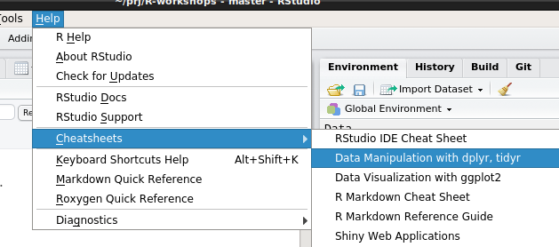

```{r setup, include=FALSE}
library(tidyverse)
knitr::opts_knit$set(
  root.dir = "../examples/tidyverse/OHBDS/"
)
knitr::opts_chunk$set(
  echo = TRUE, 
  warning = FALSE,
  message = FALSE,
  dev = "pdf",
  fig.width = 5, 
  fig.height = 3,
  width = 40, 
  breaklines = TRUE, 
  tidy.opts = list(width.cutoff = 40))

## tibble-options
options(
  tibble.print_min = 2L, 
  tibble.print_max = 4L, 
  tibble.width = 50L) 
```

# Synopsis

I was asked for *life-saving tips to make your life easier when using the computer*

- Workshop with Bodo Winter: stats OK, coding difficult
- Coding Club
    - different levels of knowledge, specific topics
    - scripting, based on personal preferences
- Observations
    - mixture of copy & past from google etc
    - unstructured workflow

## Gap

- consistent workflow from raw data to publication

---

# Framework

## Reproducible (science)

1. document every step
1. avoid (analytical) discontinuity
1. never copy & paste
1. automate where possible (**DRY**, **D**ont **R**epeat **Y**ourself)
1. consider everything not saved in a file as lost
1. single source of truth (only one copy of data files)

---

# tidyverse

> The tidyverse is a collection of R packages that share common philosophies and are designed to work together. [^2]

## collection of packages:

ggplot, tibble, tidyr, dplyr, haven, readr, string, forcats, broom, purrr…

## common "philosophy" / grammar

Basic Idea: **what** %>% **how** -> **result**

`df %>% filter(Age > 25) %>% select(Name) -> drink`

  [^2]: from http://tidyverse.org

---

# Workflow


![Workflow for data exploration [^1]](img/data-science-explore.png)

  [^1]: from *R for Data Science*, http://r4ds.had.co.nz

---

# Import

## Goal

- have *some* data in R (data frame, tibble)

## Problem

- 1000s of input sources

## Challenge

- data might update at any time during the data exploration

---

# Import

## Data Sources

- experimental data
- questionnaires


## File formats

- CSV, TSV... (readr)
- SAS, SPSS, Stat (haven)
- MATLAB
- Excel (readxl)
- data bases, SQL

---

# Import

## File Structure

At the beginning:

```
~frank/OHBDS/
            /data/raw-data.csv
            /Journal.Rmd
            /functions.R
```

- `data/*`: input
- [`Journal.Rmd`](../examples/tidyverse/OHBDS/Journal.Rmd): human centric document, also see [previous workshop](MarkUpsAndDowns.pdf)
- [`functions.R`](../examples/tidyverse/OHBDS/functions.R): functional units, code centric

---
#Import

## Raw Data

Open Hemispheric Brain Dominance Scale [^3]

- 20 scale items + reaction times
- [`codebook.txt`](../examples/tidyverse/OHBDS/data/codebook.txt) describes content
- [have a look at the data](../examples/tidyverse/OHBDS/data/raw-data.csv):

```
1|Q1  Q2  Q3  Q4…E1  E2  E3…others
2|4	1	5	1	4	2	5…
3|2	3	3	5	5	5	5…
…
29545|4	1	1	3	2	5	1	2	5…
```

  [^3]: data source: http://personality-testing.info/_rawdata/

---
# Import

## Load data

Import CSV as most people know it [^11]

```{r}
data <- read.csv("data/raw-data.csv")
# Sanity check 1, should show ~30000 rows
nrow(data)
```

**Yay!**


  [^11]: the next few slides are illustrating how work with data in a base R environment. Continue reading at "Import - the tidyverse way" if you don't need a refresher.
  
  
---
# Sanity Check

## Basic information

```{r}
# Sanity check 2, should show about 45 columns
str(data)
```

**not good**: only 1 variable

```{r}
# delete data
rm(data)
```


---
# Debug

## Where did it go wrong?

- revisit data

```
1|Q1  Q2  Q3  Q4…E1  E2  E3…others
2|4	1	5	1	4	2	5… 5423  2313…
```

## Result

- has no comma, as in Comma Separated Values (CSV)
- has "tabs" as in Tab Separated Values (TSV)


---
# Import

## Load data, again

- configure separator (using `sep="\t"`)
- use meaningful names
- develop code style (or follow [^4])


```{r}
raw_data <- read.csv("data/raw-data.csv", sep = "\t")
nrow(raw_data)
str(raw_data, list.len = 1)
```

  [^4]: http://style.tidyverse.org

---
# Refactor code


- working snippet of code into functions
- move `import()` to `functions.R`


```{r, eval = FALSE}
import <- function() {
  data <- read.csv("data/raw-data.csv", sep = "\t")
  return(data)
}
raw_data <- import()
```


## Journal.Rmd

```{r, eval = FALSE}
source("functions.R")
raw_data <- import()
```

---

# Conclusion

`raw_data <- import()`


## Good

- `raw_data` describes what is in the data
- `import()` describes what the function does
- only one run of `Journal.Rmd` to restore current R environment

## Potential problems

- generic function names (e.g `import()`, `arrange()`, `filter()`) overwrites existing ones

## Solution

- avoid name conflicts with prefix, eg `fl_import()`
- or be polite: `please_import()` :-)


---
# Import

## functions.R

```{r, eval = FALSE}
please_import <- function() {
  read.csv("data/raw-data.csv", sep = "\t")
}
```

shortened `return(rd)`, the last evaluation is always returned

## Journal.Rmd

```{r, eval = FALSE}
source("functions.R")
raw_data <- please_import()
```

Import: $\checkmark$ (good enough for now)

---

# Tidy - the 2nd step in data analysis

## What is tidy data?

- meet semantics of your data (aggregation level)
- one observation per row
- one column per variable

## example `raw_data`

- does not have Participant ID, depends on current order

## Aim

- additional Column "Participant" with "PID1" … "PID29544"

---
# Tidy - development

## functions.R

```{r}
# …
please_add_participant_id <- function(data_in) {
  data_out <- data_in
  for (i in 1:nrow(data_out)) {
    data_out[i, "Participant"] <- paste0("PID", i)
  }
  return(data_out)
}
# …
```

## Journal.R

```{r}
source("functions.R")
raw_data <- please_import()
temp_data <- please_add_participant_id(raw_data)
```


---

# Recap

- data imported into `raw_data`
- `temp_data` has additional column "Participant" with unique IDs

## Good

- writing functions for each step
    - reduces complexity
    - separation of concerns (coding details in `functions.R`, statistical data analysis in `Journal.Rmd`)
- sensible names for variable and functions
    - saves writing verbose documentation
    - "code as prose"

---

# Recap

## Bad?

- lots of different syntax
    - `read.csv` requires argument `sep=` for TSV files
    - `for` loop *feels* wrong
    - is `data[column, row]`, `data[row, column]` or `data$row[column]` correct?
    - wasn't there a function for renaming columns?
    - where is the documentation about data manipulation when I need it?
- slow
    - `please_add_participant_id()` already takes 6 seconds, just to add 30000 strings
    - how about more complex manipulation?
    - how about different aggregation level?
- Why haven't I mentioned tidyverse yet?


---

# Import the tidyverse way

- many different libraries
- syntax very similar
- learn once, apply often

## Different Libraries:

- `haven` [^5]
    - for SASS, SPSS, Stata
- `readxl` [^6]
    - for Excel files
- `readr` [^7]
    - for *rectangular* data, eg. csv, tsv, fixed width files…
    - string stays string (not factor)

  [^5]: http://haven.tidyverse.org/
  [^6]: http://readxl.tidyverse.org/
  [^7]: http://readr.tidyverse.org/

---
# Import

## `readr` - library for TSV example

- `read_csv()` can read files, URLs, text
    - columns separated by ","
    - sensible defaults for files from Excel, OpenSesame etc...
- `read_tsv()` reads files, URLs, text
    - columns separated by "\t"
- `read_delim()` …
    - `delim = ","` for CSV files (less default settings)
    - `delim = "\t"` for TSV files
    - any other separator
- in all cases
    - configuration of `NA`, `col_types`, `col_names`… 

---
# Import - example

## functions.R

```{r, eval = FALSE}
please_import <- function() {
  read.csv("data/raw-data.csv", sep = "\t")
}
```

to

```{r}
please_import <- function() {
  library(readr)
  read_tsv("data/raw-data.csv")
}
```

Import: $\checkmark$ (using tidyverse)

---

# Tidy

## `dplyr` & `tidyr` – data manipulation

- good documentation in data wrangling cheatsheet!
- some example functions to follow



---

## `%>%` - pass data between functions through the pipe [^8]

- `data %>% do_something()` is the same as `do_something(data)`
- better readability, with "verbs"
    - `data %>% sqrt() %>% add(5) %>% arrange()`
    - `arrange(add(sqrt(data), 5))`
- implicitely last verb always `print()` unless data is assigned
    - `data %>% sqrt()` is the same as \
    `data %>% sqrt() %>% print()`
    - `df %>% filter(Age > 25) %>% select(Name) -> drink` \
    doesn't print anything
    - `df %>% filter(Age > 25) %>% select(Name)` \
    prints something


  [^8]: https://github.com/tidyverse/magrittr


---

## `filter()` - filter for an observation

```{r, echo = TRUE}

temp_data %>% filter(Participant == "PID17")
```


---

## `select()` - select a column

```{r}
temp_data %>% 
  filter(Participant == "PID17") %>% 
  select(Participant, country) -> p17country
print(p17country)
```

---

## `mutate()` - add columns

```{r}
temp_data %>% 
  mutate(mean_Q = (Q1 + Q4) / 2) %>%
  filter(Participant == "PID17") %>% 
  select(Participant, country, Q1, Q4, mean_Q)
```

---

## `summarise()` – aggregate

- summarise (eg. 30000 observations) into one observation

```{r}
temp_data %>%
  summarise(
    mean_Q1 = mean(Q1),
    meanQ2 = mean(Q2), 
    elements = n()
  )
```


---

# Better additional column

## functions.R

```{r, eval = FALSE}
please_add_participant_id <- function(data_in) {
  data_out <- data_in
  for (i in 1:nrow(data_out)) {
    data_out[i, "Participant"] <- paste0("PID", i)
  }
  return(data_out)
}
```

to

```{r, warning = FALSE}
please_add_participant_id <- function(data_in) {
  data_in %>% 
    mutate(Participant = paste0("PID", 1:n()))
}
```

---

# recap

- tidyverse much faster
    - old version: 5     seconds for 30000 observations
    - new version: 0.015 seconds for 30000 observations
- easy to read
- Ceci n'est pas un pipe
- next step: tidy data

```{r}
temp_data <- please_import() %>%
  please_add_participant_id()
```

---

# Current status

## functions.R

```{r, eval = FALSE}
please_import <- function() {
  read_tsv("data/raw-data.csv")
}
please_add_participant_id <- function(data_in) {
  data_in %>% 
    mutate(Participant = paste0("PID", 1:n()))
}
```

## Journal.Rmd
```{r, eval = FALSE}
library(tidyverse)
source("functions.R")
temp_data <- please_import() %>%
  please_add_participant_id()
```


---

# tidy

## goal (reminder: what is *tidy* data)

- one column per variable
- one observation per row
- represent semantic structure of the data

## observation

- Q1…Q20 are answers to different questions, E1…E20 the according reaction times
- each question is one observation (answer, response time)
- country, introelapse etc are observations per participant

## Suggestion

- 2 aggregation levels: Participant data, Question data

---

# tidy participant data

## functions.R

```{r}
please_extract_participant_data <-
  function(data_in){
    data_in %>% 
      select( -starts_with("Q")) %>% 
      select( -starts_with("E")) %>% 
      select(Participant, everything())
  }
```

## Journal.Rmd

```{r}
participant_data <- temp_data %>% 
  please_extract_participant_data()
```

---

```{r, fig.width = 5, fig.height = 3}
ggplot(participant_data) +
  geom_point(aes(introelapse, wrapupelapse)) +
  coord_cartesian(
    xlim = c(0, 1000), 
    ylim = c(0, 1000))
```

---

# tidy question data (extract)

## functions.R


```{r}
please_extract_questions_data <-
  function(data_in){
    data_in %>% 
      select(Participant, 
             starts_with("Q"), 
             starts_with("E")) 
  }
```

---

# tidy question data (wide to long)

## functions.R

```{r}
please_tidy_question_data <-
  function(data_in){
    data_in %>%
      gather(variable, value, -Participant) %>% 
      mutate(
        question = parse_number(variable), 
        variable = substr(variable, 1, 1)) %>% 
      spread(variable, value) %>%
      rename(Answer = Q, Reaction_time = E)
  }
```

---

# Documentation

## Journal.Rmd

The only thing that needs to go in the Journal is a collection of functions whose names describe what is happening with the data. The details of implementation is *hidden* inside `functions.R`

```{r}
tidy_questions <-
  please_import() %>%
  please_add_participant_id() %>%
  please_extract_questions_data() %>%
  please_tidy_question_data()
```

---


```{r}
ggplot(tidy_questions ) +
  geom_boxplot(aes(factor(question), Reaction_time)) +
  labs(x = "Question", y = "Response time") +
  coord_cartesian(ylim = c(0, 15000))
```


---

# between aggregation levels

```{r, eval = FALSE}
combined_data_on_question_level <-
  full_join(
    participant_data,
    tidy_questions, 
    by = "Participant"
  )
print(combined_data)  
```

---

# between aggregation level

```{r}
combined_data_on_participant_level <-
  tidy_questions %>%
    group_by(Participant) %>%
    summarise(
      mean_answer = mean(Answer), 
      mean_reaction_time = mean(Reaction_time)) %>%
    left_join( participant_data , by = "Participant")
```


---

This slide is intentionally left blank for your data manipulation and plots :-)

---

# Recap


- this document shows: import, tidy, (transform, visualise)
- programming style: separate levels of concern (code vs analysis)

---

# Thanks

More examples at http://github.com/floesche/R-workshops

Also have a look at the previous workshop \
["Raw Text to Camera-Ready"](https://github.com/floesche/R-workshops/raw/master/doc/MarkUpsAndDowns.pdf)

Sorry, there was no restaurant. But you should be able to understand this much better now:

```{r, eval = FALSE}
df %>% 
  filter(Age > 25) %>% 
  select(Name) -> drink
```


