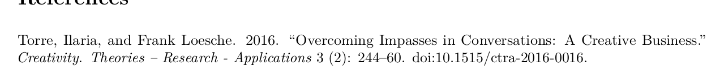
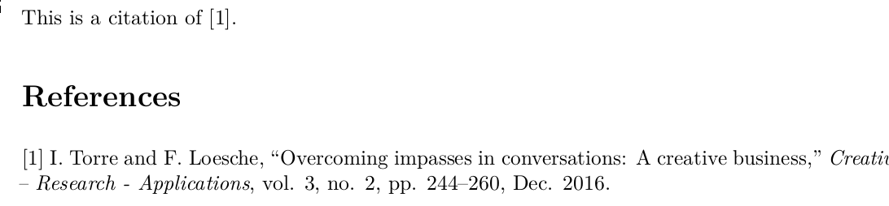
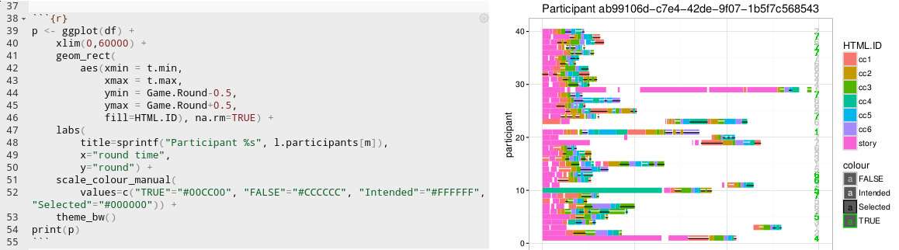

```{r setup, include=FALSE}
knitr::opts_chunk$set(echo = FALSE, dev = 'pdf', width = 40, breaklines = T, tidy.opts=list(width.cutoff=40))
```

#WYSIWYG vs Markup

## "What You See Is What You'll Get"

### Workflow

- write
- select parts of text and apply format
- visually check layout and structure

### Examples

- LibreOffice / OpenOffice
- Microsoft Word
- Google Docs
- Adobe Indesign (mostly)

***

## Annotated text

### Workflow

- write text with annotations
- check syntax
- check visual

### Examples

- HTML
- LaTeX
- Markdown


***

# 1960's GML 


Developed in 1960's to describe content of text documents for IBM's `SCRIPT` text formatter.

~~~
:h1.Generalized Markup Language (GML)
:p.Text can be marked as
:ol.
:li.headings,
:li.paragraphs, and
:li.lists.
:eol.
~~~

*GML is a procedural markup, not particularly easy to read.*

***

# 1980's LaTeX

LaTeX (and ConTeXt) are content structuring markup languages which use TeX for type setting

~~~
\section{LaTeX: Describe the document structure}

In LaTeX content can be structured, but also
directly formatted:

\begin{itemize}
  \item Markup elements for headings such 
    as \chapter{} and \subsubsection{}
  \item inline-markup, eg to \emph{emphasize} 
    certain parts
  \item direct font manipulations 
    such as \Large\textit{asd}
\end{itemize}
~~~


***

# 1980's SGML

Standardized markup language. Subsets were used in HTML and XML.

~~~
<section1>
  <h1>Standard Generalized Markup Language</h1>
  <p>Any kind of tags, with and without parameters, 
  can be defined, including</p>
  <ol>
    <li>sections,</li>
    <li>text block definitions, and</li>
    <li>inline text definitions.</li>
  </ol>
</section1>
~~~

***

# 2000's Lightweight Markup Languages

- ML are "expensive to write"
- ML difficult to learn
- Lightweight ML: 
    - easy to learn
    - intuitive to read
    - history in forum, wiki, chat, sourcecode documentation
- examples:
    - BBCode "[`[url=http://bbcode.org]Website[/url]`](http://www.bbcode.org/)"
    - reStructuredText "[`.. _rst: docutils[...]`](http://docutils.sourceforge.net/rst.html)"
    - AsciiDoc "[`asciidoc.org/[website]`](http://asciidoc.org/)"
    - Markdown "[`[website](daringfireball.net/[...])`](http://daringfireball.net/projects/markdown/)"


# Markdown

The goal of *lighweight Markup Languages* is to have text that is still **easy to read**, but that can be transformed to different outputs, for example:

- PDF
- HTML
- WYSIWYG documents:
    - Word
    - LibreOffice
    
It can be written in any text editor!


# Markdown syntax

See [`examples/BasicMDSyntax.md`](../examples/BasicMDSyntax.md) and relative outputs in [`.pdf`](../examples/BasicMDSyntax.pdf) and [`.docx`](../examples/BasicMDSyntax.docx).

* headers
* emphasis (**bold**, *italics*)
* lists
* links
* images
* tables


***

# Workflow 

1. you: 
    - edit Markdown file in text editor
    - save file
    - tell pandoc to generate a pdf
2. computer: 
    - Markdown --{pandoc(filter)}--> LaTeX
    - LaTeX --{pdflatex}--> pdf
3. you:
    - look at pdf file 


***

# Pandoc

- written by John MacFarlane (philosopher)
- *general markup converter*
- download from [http://pandoc.org](http://pandoc.org/installing.html)
- part of RStudio

- converts document structure, not layout
- also converts to output only formats (pdf, docx...)

***

# Pandoc 

- eg
    - from rST to LaTeX
    - from Markdown to pdf
    - from html to markdown
- usage (try it inside [`./examples/`](../examples/) directory^[open terminal, change directory to [`./examples/`](../examples/), run commands in terminal])
    - `pandoc Input.md --output Output.pdf`
    
    - `pandoc --from html --to markdown Input.html --output Output.md`
    - `pandoc --from markdown --to latex Input.md --output Output.pdf`
    - `pandoc --from markdown --to docx Input.md --output Output.docx`
    

***

# Pandoc - additional features

- extendable by *filters*
- settings in YAML^[Yet Another Markup Language (really!)] header
    - title, author, date
    - template
    - bibliography formatting
    
~~~
---
title: Mark ups and downs
author:
- Ilaria Torre
- Frank Loesche
tags: markup, markdown, talk
bibliography: examples/MyBibliography.bib
---
~~~

***

# Bibliography


- BibTeX
    - references from all big publishers (Springer, Elsevier, Science...) + Scholar
    - export from Mendeley
    - easy management in [JabRef](https://www.jabref.org/)

*** 

# References in MD file

See [`examples/References.md`](../examples/References.md)

***

# Bibliography setup in text file


- bibliography in same path 
    - [`examples/MyBibliography.bib`](../examples/MyBibliography.bib)
- add YAML header
    - see examples at [`examples/ReferenceTest.Rmd`](../examples/ReferenceTest.Rmd)

~~~
---
...
bibliography: MyBibliography.bib
---
~~~



***

# Change Reference style

- download required style in Citation Style Language (CSL)
- more than 8000 at <http://citationstyles.org> + [https://github.com/citation-style-language...](https://github.com/citation-style-language/styles-distribution)

## APA

~~~
...
bibliography: MyBibliography.bib
csl: apa.csl
---
~~~


***

- internal: filter pandoc-citeproc
- `bibliography` and `csl` are configured through YAML

## IEEE

~~~
...
bibliography: MyBibliography.bib
csl: ieee.csl
---
~~~




***

# RMarkdown

Markdown vs. RMarkdown

- another layer to the flow: knitr
- Rmd --{R(knitr)}--> Markdown --{pandoc}--> ...

See [`examples/BasicRMD.rmd`](../examples/BasicRMD.rmd)

***

# RMarkdown Notebook

- Literate Programming
- mix code and text
- compiler creates output format
- code blocks can run separately (fast turnaround)



***

# From "raw" text to beautiful pdf

The "quick'n'dirty" way:

1. Download LaTex template from journal
2. Export text to .tex
3. Copy all .tex document and paste into template[^1]
4. Compile pdf document in perfect format

See: FinalMD.rmd

[^1]: Note: you will probably need to change some of the parameters in the journal template before it works out. Here Google will be your best friend!

# "Hack" template

1. download template from publisher (eg [APA](http://www.ctan.org/tex-archive/macros/latex/contrib/apa6/samples))
2. modify everything above `\begin{document}` according to your needs
3. replace document content with `$body$`
4. add template to YAML of Rmd:

~~~
...
output:
  pdf_document:
    template: "apa-simple.template"
---
~~~

see [`examples/apa-simple.template`](../examples/apa-simple.template) and [`examples/exampleArticle.Rmd`](../examples/exampleArticle.Rmd)

***

# Slightly advanced hack

1. follow previous steps 1 to 4
2. modify other elements in template with YAML variables:

~~~
\keywords{APA style, demonstration}
~~~

with 

~~~
$if(keywords)$
\keywords{$for(keywords)$$keywords$$sep$, $endfor$}
$endif$
~~~

see [`examples/apa.template`](../examples/apa.template) and [`examples/exampleArticle.Rmd`](../examples/exampleArticle.Rmd)

***

# Sweave

- Literate Programming for LaTeX
- Workflow:
    - Rnw --{R(knitr)}--> LaTeX
    - LaTeX --{pdflatex}--> pdf

~~~
\section{Nomal LaTex document}

<<plot, echo=FALSE, warning=FALSE>>=
print( ggplot(df, aes(x=RT)) + geom_density() )
@

Here comes more LaTeX
~~~


***

# Why bother?

- best possible layout for every medium
    - use screen fonts (sans serif) for editor
    - eye friendly contrast
    - print optimized fonts (serif) for print outs
    - different format for different audiences (docx, pdf, epub)
- accessibility
    - only text files
    - no clash between Word 2016, Word 2003, OpenOffice...
- literate programming
    - reproducible research (replicability crisis)
    - (quantitative) data analysis and description in one document
    - figures in same document
    - no copy&paste errors

***

# Links

The most recent links are in the [README.md](../README.md).


***

# Backup

***

## 1970's TeX

Developed in the late 1970's to typeset books.

~~~
\font\xmplbx = cmbx10 scaled \magstephalf
\leftline{\xmplbx \TeX: typesetting system}
\vglue .5\baselineskip
Programming language that is 
specialised in digital typesets.
\item{1.} Particular good for mathematical formulas,
\item{2.} allows macro definition
\bye
~~~

- `troff` / `groff` are other examples for Markup Languages

***

## BTW: WYSIWYG

While 1990's WYSIWYG word processors thought it would be a good idea to use hidden binary (=non-readable) markup inside document formats such as `.doc`, they now internally use readable markup. Just rename a `.docx` file to `.zip`, open the archive and look at the file `./word/document.xml`:

~~~
<w:r>
  <w:t xml:space="preserve">This is </w:t>
</w:r>
<w:r>
  <w:rPr><w:i/><w:iCs/></w:rPr><w:t>italic</w:t>
</w:r>
~~~

*Not meant to be read by humans, but in the worst case you can.*

