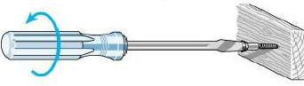

```{r setup, include=FALSE}
library(tidyverse)
library(magrittr)
library(fs)
library(modelr)
library(broom)

knitr::opts_chunk$set(
  echo = TRUE, 
  warning = FALSE,
  message = FALSE,
  dev = "pdf",
  fig.width = 5, 
  fig.height = 3,
  width = 40, 
  breaklines = TRUE, 
  tidy.opts = list(width.cutoff = 40))

set.seed(1717)

url_angry_mood <- 'https://github.com/benwhalley/just-enough-r/raw/master/data/angry_moods.csv'
url_exp13test <- 'https://github.com/sspicer/robot_club/raw/master/Exp13testdata.csv'


## tibble-options
options(
  tibble.print_min = 2L, 
  tibble.print_max = 4L, 
  tibble.width = 50L) 
```


```{r, include=FALSE}
tidy_example <- tribble(
  ~'participant_id', ~'task', ~'reaction_time',
  "pid-01", 1, 23.141,
  "pid-01", 2, 22.629,
  "pid-01", 3, 25.221,
  "pid-02", 1, 21.525,
  "pid-02", 2, 24.134,
  "pid-02", 3, 23.825
)
df <- tidy_example
```


# Tidy what?

* tidyverse is set of R packages
* @Wickham2014 suggests data format that acknowledges ``both statistical and cognitive factors''
* each observational unit: 1 table
* each observation: 1 row
* each variable: 1 column


### Goal

* every object is a data frame (`tibble`)
* common set of matching tools to manipulate
* Reduce ``mundane data manipulation chores'' [@Wickham2014]

---

## Advantages

### Think about languages:

* similar structure allows quick and easy communication (S-V-O)
* Grammar (English): S-V-O
* Example: "Frank uses tidyverse."


### Think about tools:

* same structure allows easy maintenance
* "Philosophy": One type of screw head per machine



 
---

### Tidyverse is a tool, R a language

* based on @Wilkinson2005 [p. 23]: `[Source] → (make a graph) → [Renderer]`
* Philosophy / Grammar: **input** %>% **verb** -> **result**
* or **result** <- **input** %>% **verb**
* Example: 
```{r echo=TRUE}
task_one <-
  df %>% 
  filter(task == 1)
```

* **input**: `df`, **verb**: `filter()`, **result**: `task_one`

---

### Suggestion 

* make `library(tidyverse)` a habit
* use tidyverse to describe your analysis
  * don't think of it as ``programming''
  * think in sentences: ``From dataset df filter the rows where task is equal to 1 and store the result in task_one''


---

# Elements to construct descriptions

## Tibble

* more comfortable `data.frame`

## Pipe

* `%>%`: the pipe. Take output from the left side, use it as input on the right side.
  * Example:

```{r}
task_one %>% 
  filter(reaction_time < 22) %>% 
  print()
```

---


---


---

## Verbs

* every tidyverse packages has them
* readr:: `write_csv()`, `read_csv()`,`read_rds()`
* examples for dplyr:: `filter()`, `select()`, `mutate()`, `slice()`, `distinct()`, `summarise()`, `group_by()`, `left_join()`, `rownames_to_columns()`
* ggplot2:: `ggplot()`
* modelr:: `add_predictors()`, `add_residuals()`
* broom:: `glance()`, `tidy()`
* write your own


---


### Construction of descriptions

* tidyverse offers many different **verbs**
* any number of **verbs** in one description
```{r}
task_one <-
  df %>% 
  filter(task == 1) %>%
  filter(participant_id == 'pid-01') %>%
  filter(reaction_time < 25)
```
* but: try to construct descriptions that
  * make sense (``statistically'') and 
  * are readable (``cognitively'')


---

# Workflow


![Workflow for data exploration [^1]](img/data-science-explore.png)

* Data from 
  * [`Just enough R'](https://benwhalley.github.io/just-enough-r)
  * [Stuart's robot_club](https://github.com/sspicer/robot_club)

  [^1]: from *R for Data Science*, http://r4ds.had.co.nz

---

# Import

```{r}
fn_e13 <- 'e13.csv'
# other sources, eg https://osf.io/66fvm/download
# https://zenodo.org/record/...
url_exp13test %>% str_trunc(35)
```

## download file

```{r eval=FALSE}
url_exp13test %>%
  download.file(fn_e13)
```

\bca

**open file**

```{r}
e13 <-
  fn_e13 %>% 
    read_csv()
```

\bcb

**open URL**

```{r eval=FALSE}
e13 <- 
  url_exp13test %>%
    read_csv()
```

\ec


---

```{r}
e13
# e13 %>% print()
 
```

---

```{r}
e13 %>% glimpse()
```


---

```{r}
e13 %>%
  select(partic, stage, block, trial, resp, rt) %>%
  pairs()
```

---

## Verbs for file types

* tabular data (with `readr::`)
  * csv: `read_csv()`, tsv: `read_tsv()`, fixed width: `read_fwf()`, webserver log files: `read_log()`
* Microsoft Excel (with `library(readxl)`)
  * xls and xlsx: `read_excel()`
  * select sheet: `read_excel(sheet="Raw Data")`, or `read_excel(sheet=3_)`
* Other (with `library(haven)`)
  * **SPSS** sav: `read_sav()`, por: `read_por()`
  * **SAS** xpt: `read_xpt()`, cat+bat: `read_sas()`
  * **Stat** dta: `read_dta()`


---

# Recipe 1: Open a file

\bca

**Ingredients**

* file location `fn`:
  * URL or file name
* file type
  * select *verb* `read_*()`, eg `read_csv()`

\bcb

**Expected outcome**

tibble `raw_content` with raw file content


\ec

### Method

```{r, eval=FALSE}
raw_content <-
  fn %>%
    read_csv()
```


---

## string manipulation

* `mutate()`: create new variable for each observation

```{r}
all_files <-
  tibble(
    fn = paste0("person", 1:10, ".csv")
  )
url_jer <- "https://github.com/benwhalley/just-enough-r/"
path_mf <- "raw/master/data/multiple-file-example/"
path_local <- "data/"

all_files <- 
  all_files %>%
    mutate(
      url = paste0(url_jer, path_mf, fn),
      local = paste0(path_local, fn)
    )
```


---

## Download all files

* `library(fs)`: interact with filesystem
* `rowwise()`: group data by row
* `do()`: apply function (most generic verb)
* `.`: current observation, `$`: access variable

```{r, eval=FALSE}
fs::dir_create(path_local)

all_files %>%
  rowwise() %>% 
  do(., download.file(.$url, .$local))

```

---

## Recipe 2: Open many files

\bca

**Ingredients**

* tibble `all_files` 
  * 1 file per line
  * file names `$local` or URLs `$url`
* files with the same structure
  * define column `person` as factorial data

\bcb
**Expected outcome**

* tibble `rt_data` with all observations

\ec

### Method


```{r}
col_def <- list(person = col_factor(c(1:10)))
rt_data <- 
  all_files %>%
    rowwise() %>% 
    do(., read_csv(.$local, col_types = col_def))
```

---

### Create toy data

* `select()`: select variable(s)
* `distinct()`: get unique observations
* `n_distinct()`: count unique observations
```{r}
demographics <-
  rt_data %>%
  select(person) %>%
  distinct() %>%
  mutate(
    age = sample(21:25,1),
    handednenss = sample(c("Left", "Right"),1)
  )
```

---

### Merge data

```{r}
rt_dem_data <- 
  rt_data %>%
    left_join(demographics, by = c("person"))

rt_dem_data %>% 
  glimpse()
```

---

## Plot data

* `ggplot()`: tidy way of plotting data
  * described in @Wickham2010

```{r, fig.height=2.4}
rt_data %>% 
  ggplot(aes(person, RT)) +
  geom_boxplot() +
  theme_minimal()
```

---

# Transform
## Sorting

* `arrange()`: sort ascending or `desc()`ending

```{r}
rt_data %>%
  arrange(desc(time), trial, person)
```


---

## extract observations

* `slice()`: by row position
* `sample_frac()`: sample a subset

```{r}
rt_data %>%
  sample_frac(.3) %>%
  arrange(RT) %>%
  slice(1:3)
```


---

## Group

* `group_by()`: manipulate each group separately
* use `ungroup()` to remove all groups

```{r}
rt_dem_data %>%
  group_by(trial) %>%
  summarise(
    mean_rt = mean(RT),
    count = n()) 
```


---

## Structural changes: spreading

Lets assume the RT for 1st and 2nd time are considered to be part of the same observation.

* `spread()`: spread key & value into columns
* `rename()`: change column names

```{r}
rt12_dem <- 
  rt_dem_data %>%
    spread(key = time, value = RT) %>%
    rename(RT1 = `1`, RT2 = `2`)
rt12_dem
```

---

## Structural changes: gathering

* `gather()`: columns to key-value pairs
* `parse_number()`: extract numbers from strings

```{r}
rt12_dem %>%
  gather(repetition, reaction_time, RT1:RT2) %>%
  mutate(rep = parse_number(repetition)) %>%
  glimpse()
```

---

## Create toy data

* `case_when()`: vectorized if else

```{r}
s_dat <-
  rt_data %>%
    mutate(FT = (RT * .3 * time) + runif(1, 0, RT*.8),
           f_cat = case_when(
             time == 1 ~ "foo",
             TRUE      ~ "bar" )) 
```

---


```{r}
s_dat %>%
  ggplot(aes(RT, FT)) +
    geom_point() +
    geom_smooth(method = 'lm') + theme_bw()
```

---

```{r}
s_dat %>%
  ggplot(aes(f_cat, FT)) +
    geom_point() +
    geom_violin() +
    geom_boxplot(width = .3)
```


---

## Inferential statistics as data

* `library(broom)`: convert analysis objects to tibbles
* `tidy()`: test to summary table

```{r}
attach(s_dat)
s_stat <-
  bind_rows(
    t.test(FT ~ f_cat) %>% broom::tidy(),
    t.test(RT ~ f_cat) %>% broom::tidy(),
    wilcox.test(FT ~ f_cat) %>% broom::tidy(),
    wilcox.test(RT ~ f_cat) %>% broom::tidy(),
    cor.test(FT, time) %>% broom::tidy(),
    cor.test(RT, time) %>% broom::tidy()
  )
detach(s_dat)
```


---

* `select()` to reorder
* `everything()` selects all variables

```{r}
s_stat %>%
  select(method, p.value, everything()) %>% 
  filter(p.value < 0.01) %>% glimpse()
```


---

## define toy models

```{r}
s_model1 <- lm(FT ~ RT, data = s_dat)
s_model2 <- lm(FT ~ RT + f_cat, data = s_dat)
s_model3 <- lm(FT ~ RT * f_cat, data = s_dat)
```


---

* `library(modelr)`: modelling for the pipe
* `add_predictions()` and `add_residuals()` per observation

```{r, eval=F}
s_dat %>%
  add_predictions(s_model1, "pred1") %>%
  add_residuals(s_model1, "res1")
```

```{r, echo=F}

s_dat %>%
  add_predictions(s_model1, "pred1") %>%
  add_residuals(s_model1, "res1")  %>% select(-Condition, -time, -person, -f_cat)
```

---

* `augment()`: create predictions, residuals etc
* `augement_columns()`: add to existing data

```{r, eval=F}
s_model1 %>% 
  augment_columns(rt_data)
```
```{r, echo=F}
s_model1 %>% 
  augment_columns(rt_data) %>% as_tibble() %>%
  select(Condition, person, .fitted, .resid, everything())
```


---

## Plot model parameters

```{r}  
model_comp <- 
  bind_rows(
    s_model1 %>% tidy(conf.int = T) %>% 
      mutate(model = 1),
    s_model2 %>% tidy(conf.int = T) %>% 
      mutate(model = 2),
    s_model3 %>% tidy(conf.int = T) %>% 
      mutate(model = 3)) 
```

---

```{r}
model_comp %>%
  ggplot(aes(term, estimate, 
             ymin = conf.low, ymax = conf.high, 
             colour = factor(model))) +
  geom_pointrange(position = position_dodge(width = .2))
```


---

## Prepare data for model comparison

```{r, eval=F}
bind_rows(
  s_model1 %>% glance(),
  s_model2 %>% glance(),
  s_model3 %>% glance()
)
```

```{r, echo=F}
bind_rows(
  s_model1 %>% glance(),
  s_model2 %>% glance(),
  s_model3 %>% glance()
) %>% as_tibble() %>% select(r.squared, AIC, sigma, everything())
```


---

## Flexibility: write your own verb


### In `function.R`:

```{r, eval=FALSE}
please_clean_dataset <- function(df) {
  df %>%
    janitor::clean_names() %>%
    filter(!is.na()) %>%
    filter(x < 1) 
}
```

### in main document:

```{r, eval=F}
df %>% please_clean_dataset() %>% please_remove_outliers()
```


* more details on `polite programming' at [doc/DataWorkflow.pdf](DataWorkflow.pdf)

---

# Communication

* Seamless integration in publications
* see session on literate programming: [Marks Ups and Downs](MarkUpsAndDowns.pdf)
* reproducible science

---

# Summary


* tidyverse offers consistent syntax from data import to communication
* KISS & WORE principle
* you can focus on what, not on how
* easily extensible
* many different extensions exist

---

# Conclusion

* tidyverse makes life easier, focus on the science not on data wrangling
* [teach the tidyverse to beginners](http://varianceexplained.org/r/teach-tidyverse/)

---

# References
